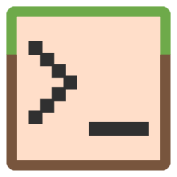

### A Bedrock mcfunction shell and interpreter

***
# FAQ
## What is Shulker Bash?
Shulker Bash is a shell and interpreter for running Bedrock mcfunctions. It allows you to write, test and debug mcfunctions outside of Minecraft, as well as write real programs to run on the Windows command line.

## What use does Shulker Bash have?
Primarily, Shulker Bash is an [esoteric programming languages](https://en.wikipedia.org/wiki/Esoteric_programming_language). It's primary goal is to challenge developers, and to make mcfunction into a useable [code golf](https://en.wikipedia.org/wiki/Code_golf) language. However, it is not without practical use. Shulker Bash gives developers a simple work enviroment to debug and test their code, before importing it into Minecraft.

## How does Shulker Bash work?
When you run a Shulker Bash program, a 'virtual' Minecraft world is created. Your program then interface with this Minecraft world as if it were a real one. This creates a seamless transition between developing for Shulker Bash and for Minecraft.

## What can Shulker Bash do?
Many of the core features developers use within Minecraft have been implemented into Shulker Bash. These include: Manipulating Blocks, Manipulating Entities and Manipulating Scoreboards. Shulker Bash also contains some custom syntax to allow developers to read from standard input (using /scoreboard), write to standard output (using /say) and rendering blocks. Shulker Bash is turing complete though, so go nuts!

## What can't it do?
At the moment, you can't make any system calls except reading from STDIN and writing to STDOUT. Some Minecraft commands are also not currently supported. The list of supported commands can be found below.

***
# Installation and Use
## Download 
- **Not Yet Available**

## Using Shulker Bash
When you install Shulker Bash, it adds "shulker" as a system command (Windows).
You can run a program on the interpreter by specifying the path of the main mcfunction as a command line argument. The directory of the mcfunction file will act as the root directory. If no path is specified, Shulker Bash will enter the shell.
The main mcfunction file is ran relative to an entity of type "player" and name "main" 

There is a number of flags you can specify:
- -h, --help: Output a list of valid arguments
- -r, --read: Import world from 'world.json'
- -w, --write: Export world to 'world.json' on exit
- -l, --loop: Runs the program 20 times per second until exit
- -d, --dir = VALUE: Set the base directory of the program

## Bugs and Issues
Please report any bugs and issues you find [here](https://github.com/byAdam/Shulker Bash/issues). If you have any questions or queries, feel free to contact me by email (adambrady2000@gmail.com) or on [Twitter](https://twitter.com/byAdam_Net)
